# Git

<center>
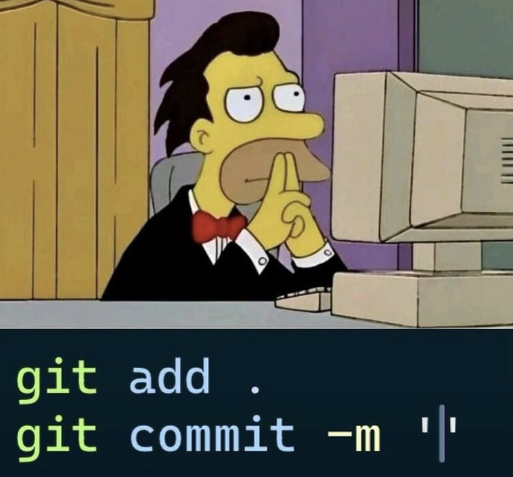
</center>

Un projecte **Git** guarda l'historial de canvis d'un projecte i permet la col·laboració de diversos desenvolupadors.

- **GitHub** és una plataforma web, que permet treballar amb projectes **Git**

- **GitHub Desktop** és una eina que permet gestionar projectes GitHub de manera gràfica.

## Projecte de prova

Fes un projecte al teu compte de GitHub anomenat 'HelloGit'

- Ves a [GitHub](https://github.com/)
- Pestanya **Repositories**
- Botó **New**
- Repository name: HelloGit
- Create repository

Amb l'aplicació **GitHub Desktop** importa el repositori que acabes de crear:

- File > Clone Repository
- Busca 'HelloGit'
- Botó **Clone**

Obre aquest projecte amb **Visual Studio Code**, i posa-hi un nou arxiu:

```text
helloGit.py
```

**Nota**: Veuràs que el nom de l'arxiu apareix de color verd, això vol dir que és un arxiu nou que no està al Git remot.

Edita l'arxiu per fer un 

```python
print("Hello Git!")
```

<center>
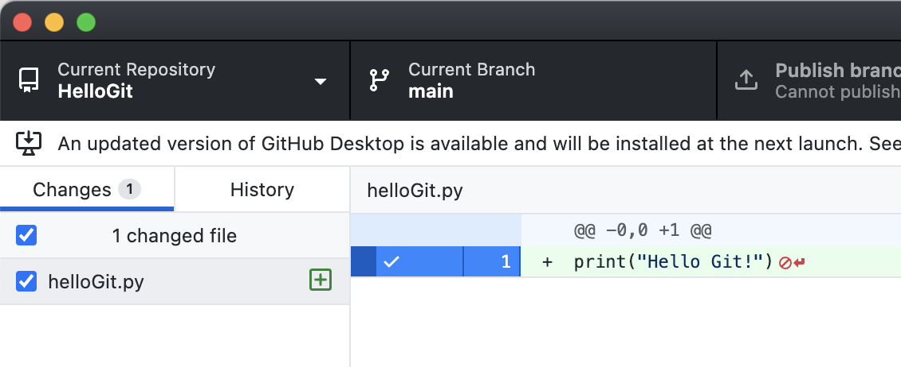
</center>

Si vas a GitHub Desktop, veuràs que apareix una modificació a la pestanya "Changes". Que és el nou arxiu que has creat.

Ara pots pujar aquest codi a GitHub. 

## Primer commit

**Nota:** Com que encara no has enviat res d'aquest projecte a GitHub, el botó **Publish branch** diu: *"Cannot publish unborn HEAD"*

Per enviar modificacions a GitHub cal fer un commit, i per fer un commit cal explicar què estàs enviant.

- Posa una descripció dels canvis que has fet a l'apartat "Commit"
- Apreta el botó **Commit to main**

<center>
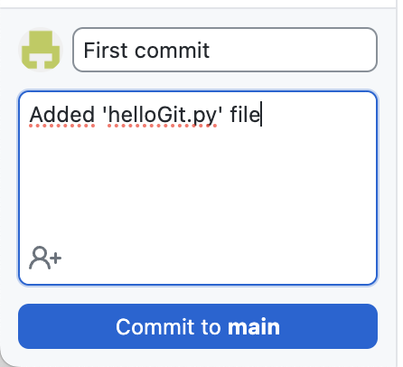
</center>

Com que és la primera vegada que enviem modificacins a aquest projecte, hem de publicar la branca:

- Apreta a 'Publish branch'

<center>
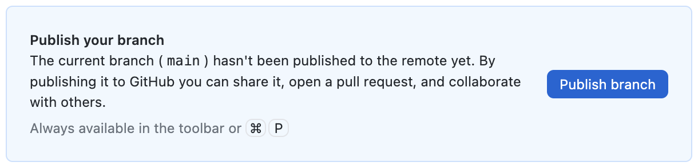
</center>

Torna a *Visual Studio Code* i modifica l'arxiu, deixa'l així:

```python
print("Hello Git!")
print("New modification")
```

Veuràs que ara el nom de l'arxiu surt de color marró clar, això indica que hi has fet modificacions.

<center>
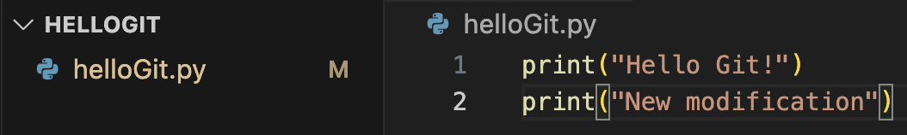
</center>

- Torna a GitHub Desktop, i apunta el comentari de la nova modificació.
- Apreta el botó **Commit to main**

<center>
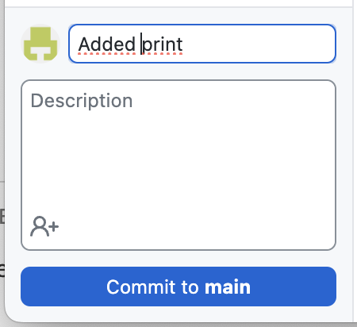
</center>

Ara pots enviar els canvis a GitHub apretant el botó 'Push origin'

<center>
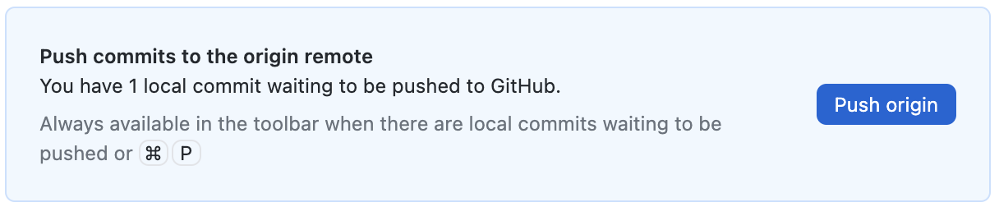
</center>

## Veure commits a GitHub

Amb el navegador, al projecte de GitHub, pots veure els commits que s'han fet per aquest codi.

- Apreta sobre la opció **Commits** de la web de GitHub:

<center>
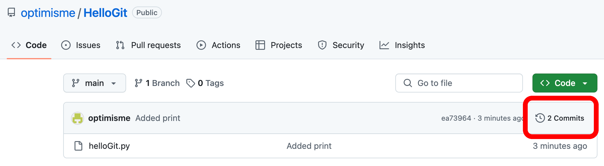
</center>

Veuràs una llista amb els commits d'aquest projecte.

- Escull un dels commits:

<center>
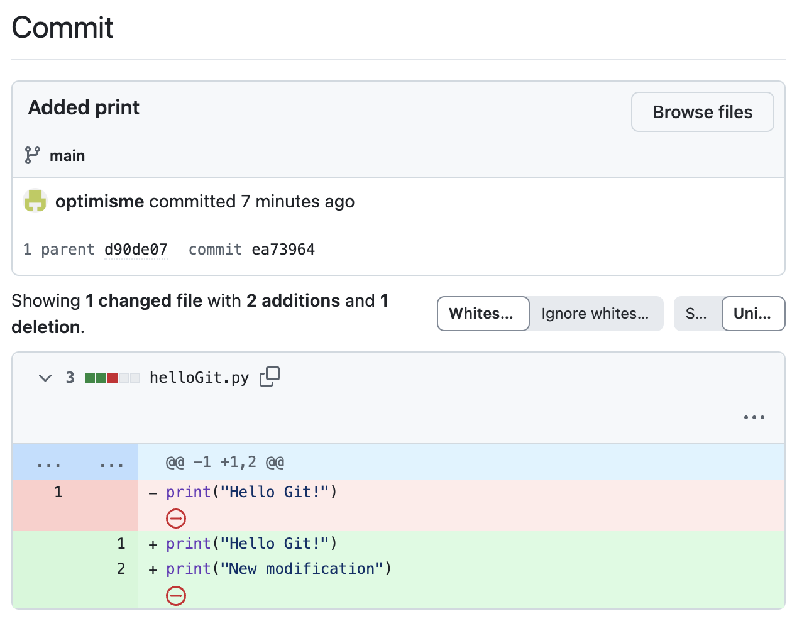
</center>

Veuràs els canvis del commit.

- En vermell el què s'ha tret
- En verd el què s'ha afegit

## Commits des de Visual Studio Code

Des de **Visual Studio Code**, també pots fer commits.

Modifica l'arxiu 'helloGit.py' així:

```python
print("Hello Git!")
print("Git from VSC")
```

A la pestanya **Source Control** veuràs que apareix un número 1 (un arxiu amb canvis), i una llista 'Changes' amb l'arxiu que té modificacions (helloGit.py).

<center>
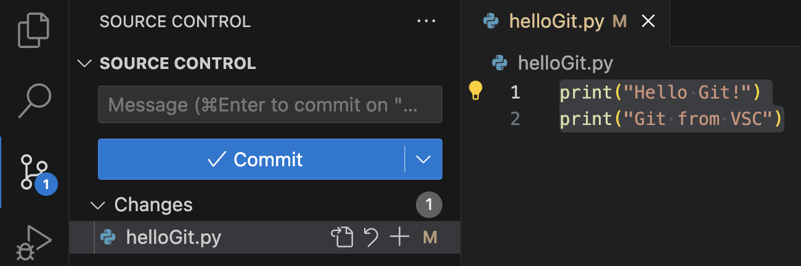
</center>

Si sel·lecciones l'arxiu, veuràs dues columnes, una amb la versió anterior de l'arxiu i una amb la nova.

Igualment, les parts que s'han esborrat estàn en vermell i les noves en verd.

<center>
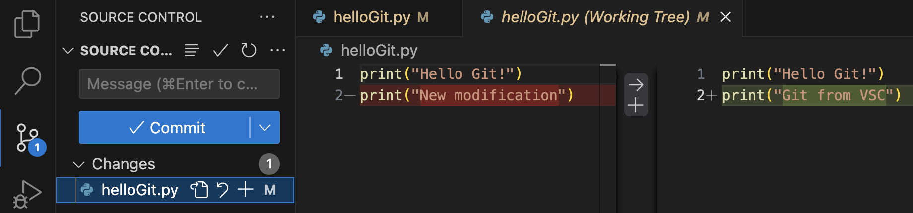
</center>

Podries desfer els canvis amb la fletxa "enrrera" que diu "Discard Changes", però no ho facis.

Posa un comentari amb el canvi a l'espai **Message**

<center>
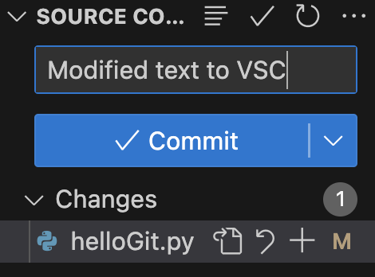
</center>

I apreta el botó **Commit**

Igual que amb l'aplicació **GitHub Desktop** després de fer un commit, habies d'enviar els canvis amb **Publish Branch**, des de **Visual Studio Code** has de publicar els canvis amb **Sync Changes**

<center>
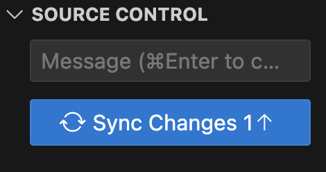
</center>

## Commits des de la terminal

Des de la linia de comandes també pots fer commits.

Modifica l'arxiu 'helloGit.py' així:

```python
print("Hello Git!")
print("Git from CMD")
```

Obre un terminal i escriu:

```bash
git status
```

<center>
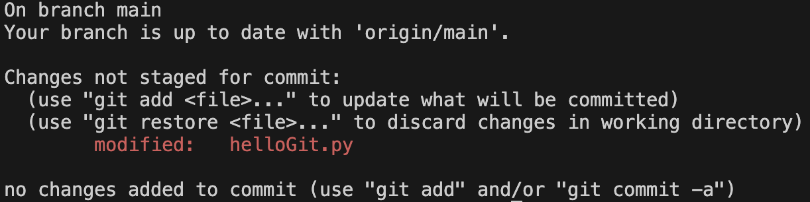
</center>

Aquesta comanda llista l'estat del projecte Git, en aquest cas ens diu que hem modificat l'arxiu 'helloGit.py'

Podriem veure les modificacions que s'hi han fet amb:

```bash
git diff helloGit.py
```

<center>
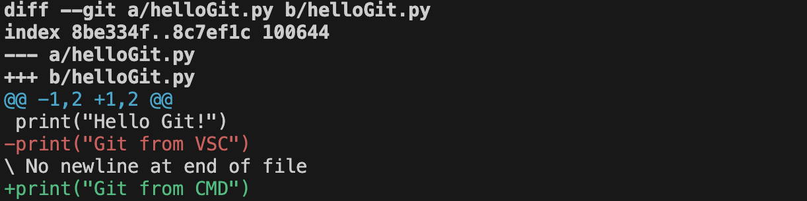
</center>

Igualment, amb vermell surt el què hem esborrat i amb verd el què hem afegit.

Com que els canvis no s'han enviat, ni s'ha fet cap commit, podriem descartar els canvis amb la següent comanda, **però no ho facis**:

```bash
git checkout -- helloGit.py
```

Per enviar els canvis des de la linia de comandes:

- Primer cal afegir els arxius que volem commentar:

```bash
git add helloGit.py
```

- O bé, per afegir tots els arxius amb modificacions:

```bash
git add .
```

- Després, cal posar el commentari. Es posa entre commetes després de **"-m"**

```bash
git commit -m "Modified VSC for CMD"
```

- Finalment, per enviar-ho al servidor tal i com fem visualment amb *Publish Branch*, o *Sync changes*, cal fer un **push**:

```bash
git push
```

<center>
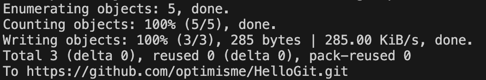
</center>

## Actualitzar les dades amb linia de comandes

Per actualitzar els arxius locals, amb les modificacions remotes:

```bash
git pull
```

Per, a més esborrar arxius i carpetes que ja no existeixen en remot:

```bash
git fetch --prune
git stash
git pull
git stash clear
```

## Historial de modificacions a GitHub Desktop

La pestanya **History** de *GitHub Desktop* també ens mostra l'historial de modificacions.

<center>

</center>
