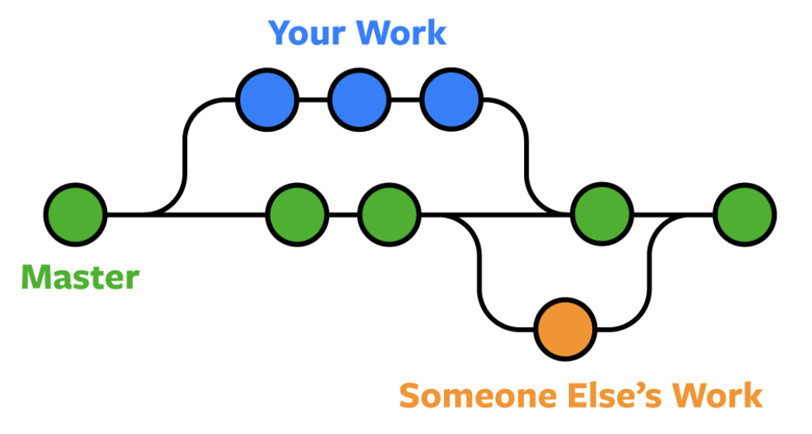
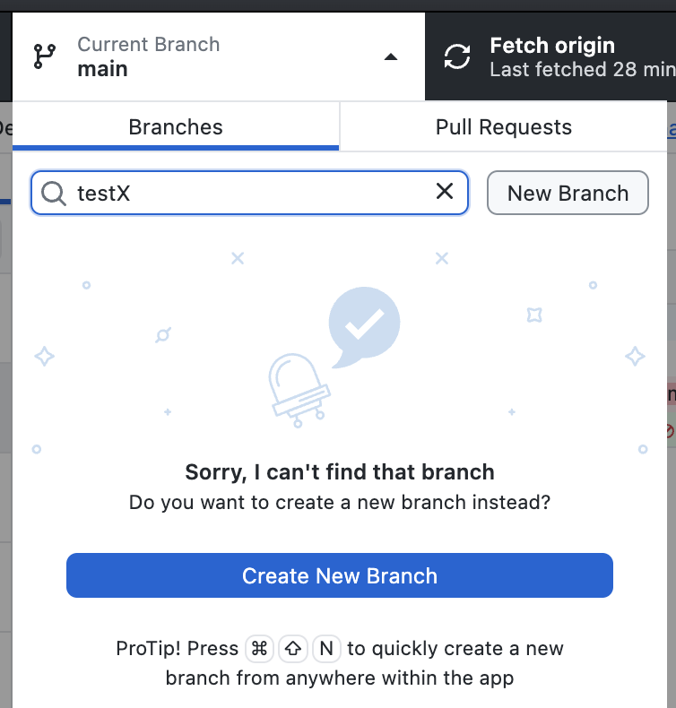
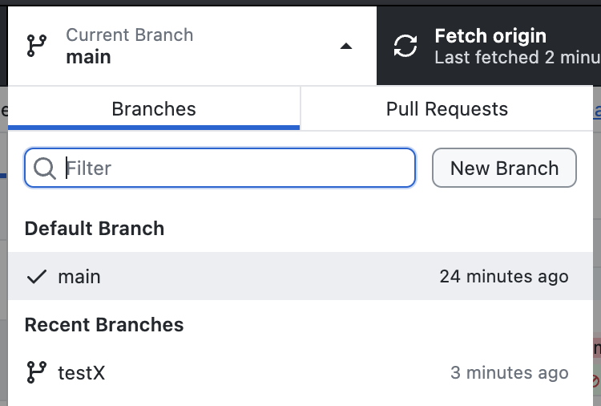
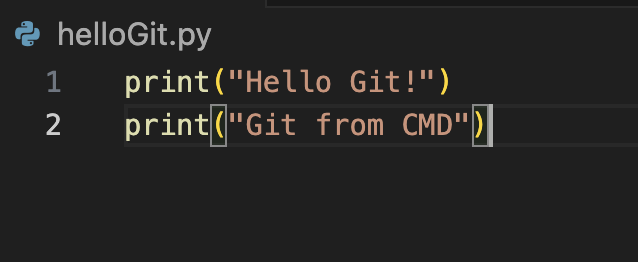
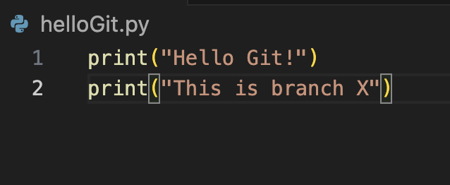
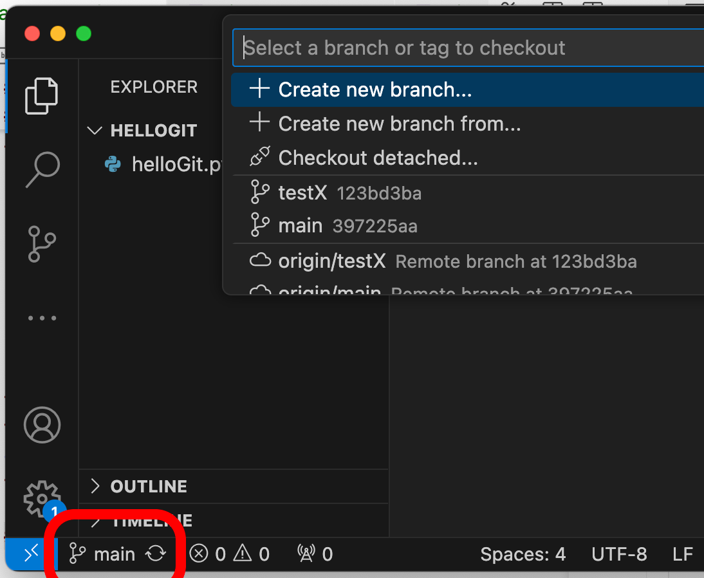
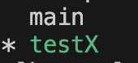

# Branques (branch)

Una branca en **Git** és una línia de desenvolupament paral·lela que permet treballar en canvis sense afectar la **branca principal**.

## Branca principal "main"

Cada projecte té una branca per defecte (normalment main o master).

Git permet crear branques de codi paral·leles a la principal per:

- Treballar en equip
- Arreglar bugs
- Desenvolupar noves funcionalitats
- Provar canvis al codi
- ...

<center>

</center>

Quan el codi d'una branca està llest, es pot combinar (fer un **merge**) amb la branca principal.

## Branques amb GitHub Desktop

Per crear branques amb GitHub Desktop, escriu el nom de la nova branca al formulari de gestió de branques.

En aquest cas crearem la branca **"testX"**

<center>

</center>

Quan crees una nova branca amb **GitHub Desktop**, automàticament queda sel·leccionada.

Però perquè remotament existeixi aquesta branca, cal fer **Publish Branch**

<center>

</center>

Després vés al codi de l'arxiu *"helloGit.py"* i modifica'l així:

```python
print("Hello Git!")
print("This is branch X")
```

**Guarda els canvis** i fes un commit:

```bash
git add .
git commit -m "New text for X"
git push
```

## Escollir la branca amb GitHub Desktop

A **GitHub Desktop** pots escollir la branca de treball, veuràs que si esculls la branca **main**:

<center>

</center>

A la branca **main** el codi de *helloGit.py* és així:

```python
print("Hello Git!")
print("Git from CMD")
```

<center>

</center>

En canvi a la branca **testX** és així:

```python
print("Hello Git!")
print("This is branch X")
```

<center>

</center>

## Escollir la branca amb Visual Studio Code

Amb **Visual Studio Code** pots canviar fàcilment de branca *Git* amb el botó inferior esquerra de l'aplicació.

<center>

</center>

Veuràs que al canviar de branca canvia automàticament el contingut del codi.

## Escollir la branca amb linia de comandes

Amb linia de comandes pots veure les branques disponibles:

```bash
git branch -a
```

<center>

</center>

Per escollir una branca des de la linia de comandes es pot fer *git switch nomBranca*:

```bash
git switch testX
```

Veuràs que al canviar de branca canvia automàticament el contingut del codi.

**Nota**: Tingues en compte que pots tenir branques locals, no publicades al servidor!

## Crear i esborrar branques amb linia de comandes

Per crar una branca amb linia de comandes es posa *git branch nomBranca*.

- Crear la branca *"testY"*:
```bash
git checkout -b testY
```

- Publicar la branca *"testY"* al servidor:
```bash
git push --set-upstream origin testY
```

**Nota**: Al ber *--set-upstream* s'estableix una connexió entre la branca local i la seva contrapart remota. Això permet fer *git push* i *git pull* sense especificar el remot i la branca cada vegada.

- Esborrar la branca *"testY"* localment, esborrant tots els canvis:
```bash
git branch -D testY
```

- Esborrar la branca *"testY"* del servidor:
```bash
git push origin --delete testY
```

## Treball local i remot (opció Branch)

Crea una nova branca per al treball local (si no ho has fet ja):

- Crea una nova branca per al treball local

```bash
git checkout -b exercicis
git add Java-R/Teoria/src/main/java/com/exercici*
git commit -m "Guardar exercicis locals"
```

Per actualitzar els canvis remots:

- *git checkout main*: Torna a la branca principal
- *git pull origin main*: Descarrega els canvis remots
- *git checkout exercicis* i *git merge main*: Fusiona cap a la branca local

```bash
git checkout main
git pull origin main
git checkout exercicis
git merge main
```

Resol manualment els conflictes

```bash
git add Java-R/Teoria/src/main/java/com/fitxer_afectat
git commit -m "Resol conflictes"
```
