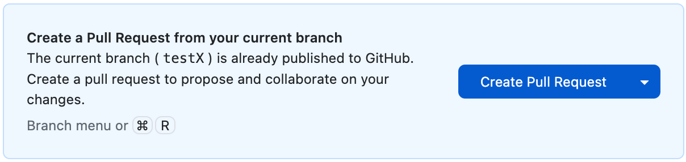
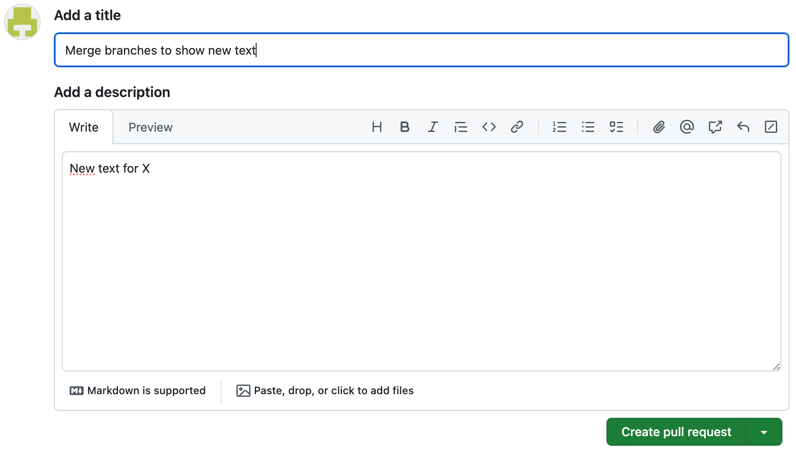
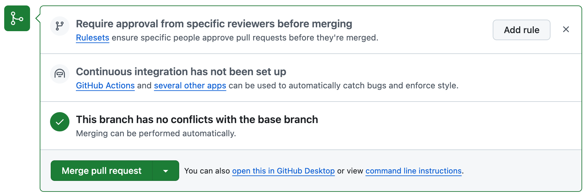
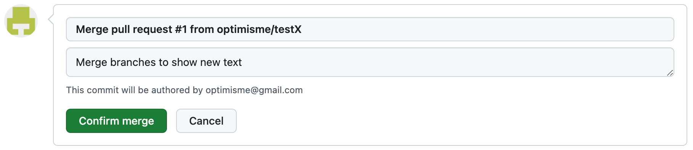
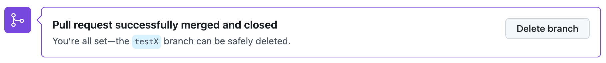
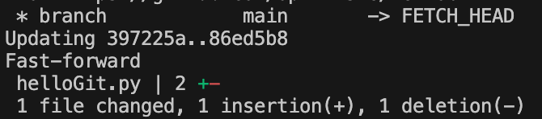
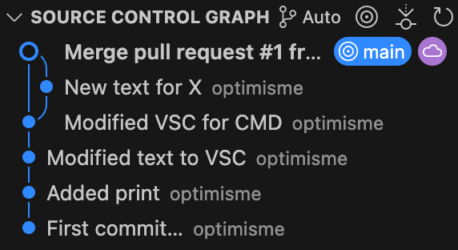
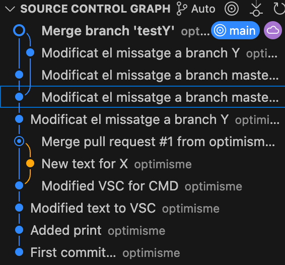

# Merge (unir)

Sovint, un cop hem estat treballant amb una branca, volem unir (merge) els canvis amb la branca principal.

Els passos per ajuntar dues branques a **GitHub** són:

- Crear una **Pull request**, que és una petició per revisar i fusionar els canvis a la branca principal
- Fer un **merge**, que és  l'acció tècnica de combinar els canvis

## Pull request a GitHub

Per fer una **pull request** amb **GitHub Desktop***:

<center>

</center>

Apretar aquest botó ens portarà cap a la pàgina web de **GitHub** que correspon a aquesta petició. 

En aquesta pàgina hem de fer una explicació de perquè volem fusionar la nostra branca amb la branca principal.

**Nota:** Normalment, aquest pas es fa per arreglar errors, i al fer la **pull request** s'explica quins canvis s'han fet al codi per arreglar l'error.

<center>

</center>

Després els usuaris amb permissos per fer **pull request** hauràn de validar i aprovar els canvis al codi principal.

<center>

</center>

Si sou vosaltres mateixos, feu l'aprovació l'heu de fer des del mateix usuari.

<center>

</center>

Finalment, es pot esborrar la branca que s'ha fusionat.

<center>

</center>

Finalment, ens hem d'assegurar de tornar a escollir la branca principal i descarregar els canvis remots:

```bash
git checkout main
git pull origin main
```

<style>
.image-container {
    align-items: flex-end;
    display: flex;
    justify-content: space-between;
    margin-top:48px;
    width: 100%;
}

.image-item {
    display: flex;
    flex-grow: 1;
    flex-direction: column;
    padding: 0px;
    display: flex;
    justify-content: center;
    align-items: center;
}

.image-item img {
    max-height: 250px;
    height: auto;
    width: auto;
    max-width: 90%;

}

.image-item-big img:first-child {
    max-height: 500px !important;
}

.image-item div {
    color: #444444;
    text-align: center;
}
</style>
<div class="image-container">
    <div class="image-item">
        
        <div>pull</div>
    </div>
    <div class="image-item">
        
        <div>branques</div>
    </div>
</div>
<br/>
<br/>

## Conflictes

A vegades, les branques no es poden unir perquè els codis són incompatibles i es produeixen conflictes.

Ara provocarem un conflicte, en una nova branca **"testY"**:

Crear la nova branca:
```bash
git checkout -b testY
```

Modificar el codi de **'helloGit.py'** a la branca **"testY"** així:
```python
print("Hello Git!")
print("This is branch Y")
```

Enviar els canvis de **"testY"**:
```bash
git add .
git commit -m "Modificat el missatge a branch Y"
```

Canviar a la branca principal per fer-hi també canvis:
```bash
git switch main
```

Modificar el codi de **'helloGit.py'** a la branca **"main"** així:
```python
print("Hello Git!")
print("This is branch main !!")
```

Enviar els canvis de **"main"**:
```bash
git add .
git commit -m "Modificat el missatge a branch master"
```

Intentar fer un **merge** de **testY** amb **master**:
```bash
git merge testY
```

Aleshores veiem que no podem unir les branques:

<center>

</center>

Aleshores, hem de veure que el fitxer **"heloGit.py"** té aquest contingut:

```python
print("Hello Git!")
<<<<<<< HEAD
print("This is branch main !!")
=======
print("This is branch Y")
>>>>>>> testY
```

El codi ha canviat, i ara mostra les dues parts en conflicte. L'hem d'arreglar nosaltres manualment, perquè **Git** no sap com fer-ho. Modifiquem el codi per arreglar-lo:

**Nota:** Evidentment, cal treure "<<<<<<< HEAD" i "======="

```python
print("Hello Git!")
print("This is branch main mixed with Y !!")
```

Un cop hem arreglat el conflicte.

- Guardem l'arxiu
- Fem un **commit** i un **push** per fer el **merge**

```bash
git add .
git commit -m "Fix merge conflict"
git push
```

Ja es poden veure els canvis a l'historial.

<center>

</center>

**Important**: Fixeu-vos que aquest segon cop, hem fet una branca i l'hem mesclat sense fer un **Pull request** a **GitHub**!


