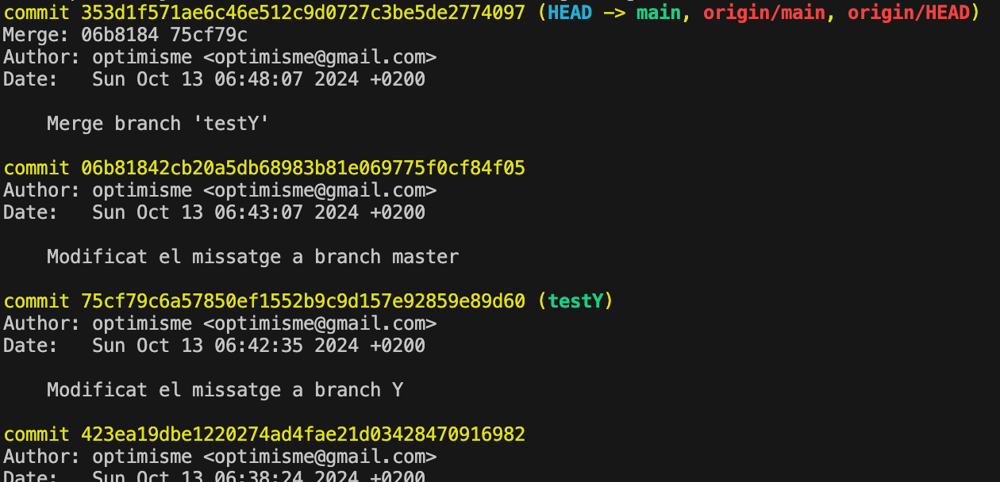
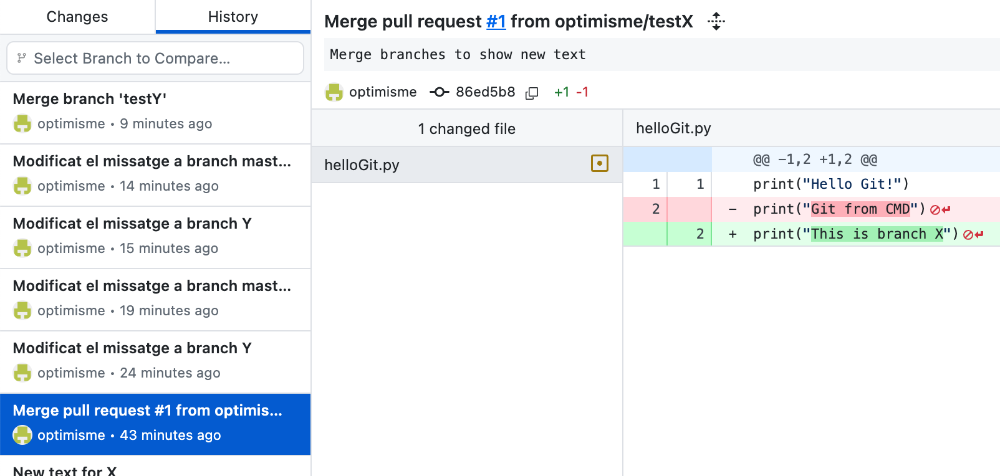
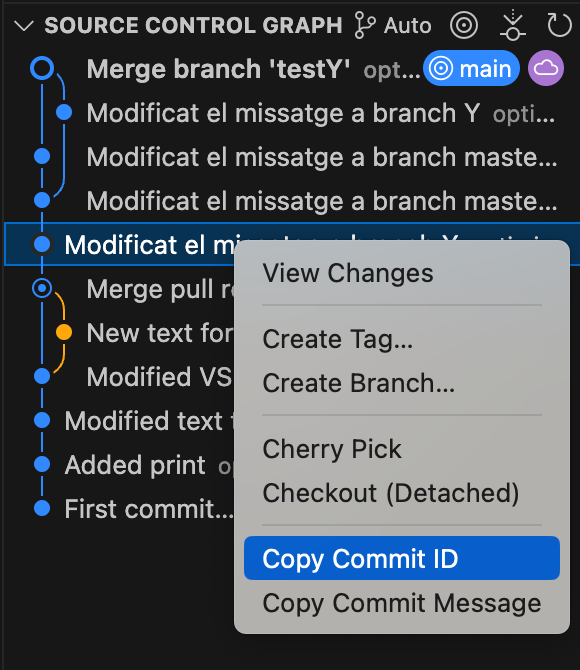
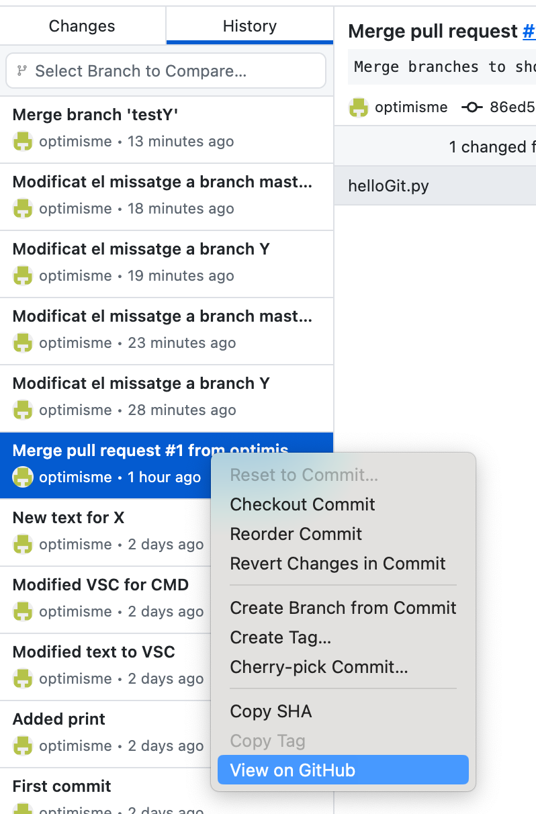
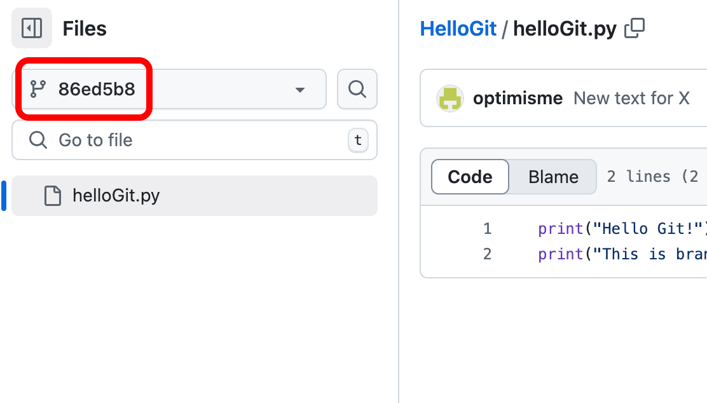
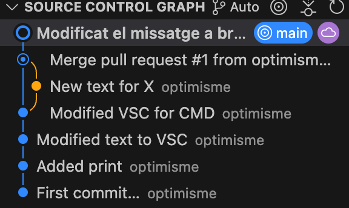

# Historial Git

## Identificadors de commit

Per veure l'historial del nostre projecte **Git** podem fer:

```bash
git log
```

Mostra una sortida tipus:

<center>

</center>

On veiem els **identificadors dels commits**, que ens permet veure punts anteriors del codi.

En realitat, amb els primers 7 caràcters de l'identificador ja en tenim prou.

També podem veure la informació de cada còmit de manera visual:

<style>
.image-container {
    align-items: flex-end;
    display: flex;
    justify-content: space-between;
    margin-top:48px;
    width: 100%;
}

.image-item {
    display: flex;
    flex-grow: 1;
    flex-direction: column;
    padding: 0px;
    display: flex;
    justify-content: center;
    align-items: center;
}

.image-item img {
    max-height: 250px;
    height: auto;
    width: auto;
    max-width: 90%;

}

.image-item-big img:first-child {
    max-height: 500px !important;
}

.image-item div {
    color: #444444;
    text-align: center;
}
</style>
<div class="image-container">
    <div class="image-item">
        
        <div>History, GitHub Desktop</div>
    </div>
    <div class="image-item">
        
        <div>Visual Studio Code</div>
    </div>
</div>
<br/>
<br/>

A la pàgina de **GitHub** podem navegar pel codi, tal i com estava en un punt o branca anterior:

<center>

</center>

Fixeu-vos que **GitHub** permet navegar a partir de l'identificador de commit:

<center>

</center>

## Reset

A vegades, volem tornar enrrera a un punt anterior del nostre codi.

Si vull tornar a un punt anterior, per exemple al commit amb id **"945bcada6b1d6d77c94ee8442e2d18191348de06"** podria fer:

```bash
git reset --hard 945bcad
git push --force
```

Veureu com hem esborrar tots els canvis de l'arbre de treball, en local i en remot.

<center>

</center>

**Nota:** Si voleu simplement tornar a un punt anterior, i poder revisar tots els commits, poseu la opció "--soft" enlloc de "--hard"

